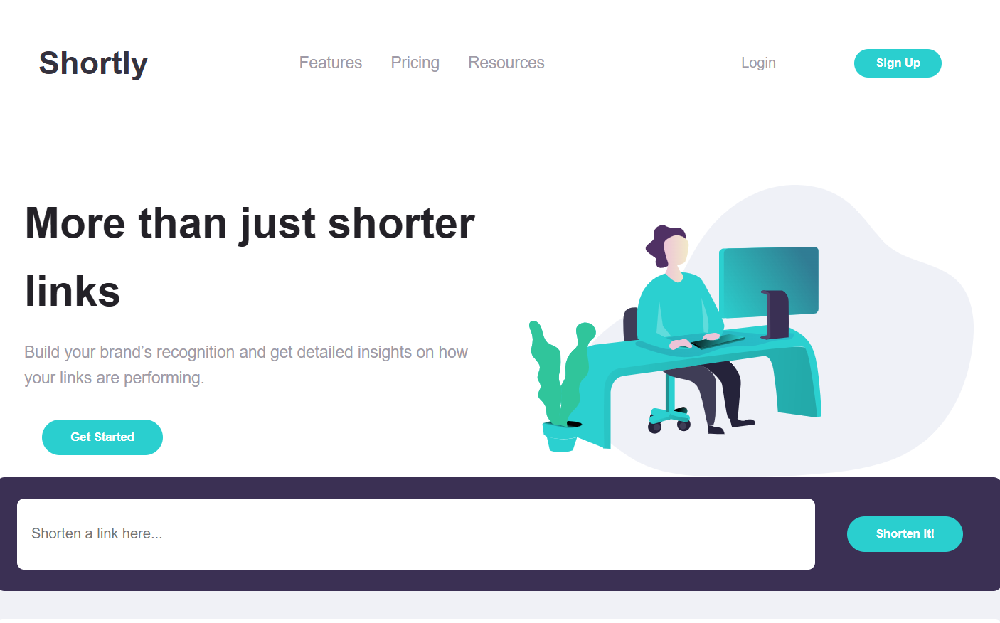

# 🔗 URL Shortener Landing Page

A modern, responsive React app that allows users to shorten URLs using the TinyURL API and view their previously shortened links. Built with Vite and styled using custom CSS.

---

## 📌 Overview

### ✅ The Challenge

Users should be able to:

- View the optimal layout for any screen size  
- Shorten any valid URL using an external API  
- See a list of their shortened links, even after refreshing  
- Copy a shortened link to the clipboard  
- See an error message if the input is empty  

---

### 🖼 Screenshot

---

### 🔗 Links

- 🔧 Solution Repo: [GitHub Repository](https://github.com/callmesophiii/url-shortening-api-master)  
- 🌐 Live Site: [View Live on Netlify](https://url-shortening-api-master-orcin.vercel.app/)

---

## 🛠 My Process

### 🏗 Built With

- HTML5 & Semantic Markup  
- CSS3 (Custom properties, Flexbox, Grid)  
- Mobile-first Responsive Design  
- React (via Vite)  
- React Hooks (`useState`)  
- TinyURL API  
- LocalStorage API

---

### 📚 What I Learned

This project helped me gain practical experience with:

- Consuming public APIs using `fetch` in React  
- Handling errors and network issues with `try/catch`  
- Saving and retrieving data from localStorage  
- Responsive layout using Flexbox and media queries  
- Working around CORS and API limitations (e.g., switching from CleanURI to TinyURL due to CORS)

---

### 🔧 Continued Development

I'd like to:

- Add a "Copy to Clipboard" button with feedback animation  
- Show the link list immediately after shortening  
- Add loading/error states using custom UI elements  
- Use a backend proxy in the future for APIs with CORS issues

---

### 🔍 Useful Resources

- [TinyURL API Docs](https://tinyurl.com/app/dev) – Super simple and reliable API for shortening links  
- [CSS Tricks Flexbox Guide](https://css-tricks.com/snippets/css/a-guide-to-flexbox/) – Helped with layout  
- [React Docs](https://react.dev/) – Essential for hooks and component structure

---

## 📘 Reflection

During the development of the URL Shortener landing page, I focused on building a fully responsive, modern interface using **React** and **Vite**. I began by setting up a clean project structure with reusable components, including the header, hero section, URL input form, statistics section, feature cards, and footer. This modular approach made it easier to manage layout and styling across the application.

One of the main challenges was achieving consistent responsiveness across different screen sizes. I resolved this by using **Flexbox** and custom media queries to control layout behavior on smaller viewports. Another challenge involved styling the URL input form and dynamically handling error states. To address this, I used state-driven styling in combination with utility classes and conditional rendering for error messages.

I also spent time optimizing CSS using custom properties (`--color-name`) for better theme control and easier maintenance. Component state management and static data handling were straightforward, but I plan to enhance functionality by integrating a real URL shortening API (like shrtcode) and adding persistent storage for shortened links.

Overall, this project helped me strengthen my frontend skills, particularly in structuring a scalable React app and applying clean, accessible UI practices. In the future, I aim to implement dark mode, add real-time form validation, and improve accessibility features to make the project more production-ready.

---

## 👤 Author

- GitHub: [@callmesophiii](https://github.com/callmesophiii)  
- Frontend Mentor: [@callmesophiii](https://www.frontendmentor.io/profile/callmesophiii)

---

## 🙌 Acknowledgments

Thanks to Frontend Mentor for this challenge and to TinyURL for their freely accessible API. Also shoutout to OpenAI's ChatGPT for assistance troubleshooting API and CORS issues during development.

